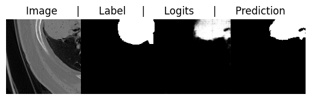
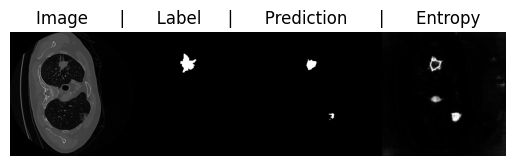
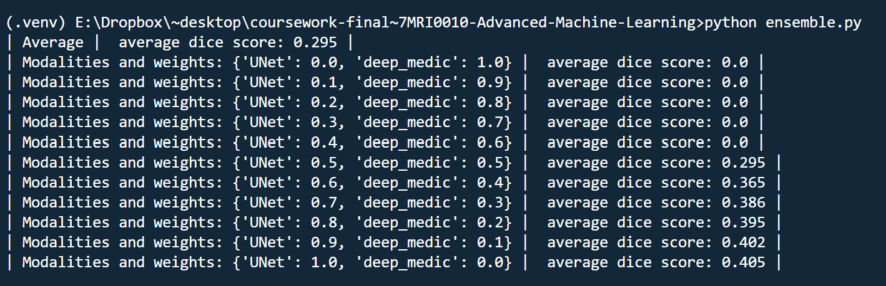

# UNet-Ensemble-Learning for Lung Tumor Segmentation
This project focuses on the application of the U-Net architecture for the segmentation of lung tumors. For a detailed exploration and methodology, please refer to [segmentation.pdf](segmentation.pdf) report.

## Visual Insights

### Logits

### Uncertainty Estimate
The image below shows the model's uncertainty estimates for tumor segmentations.

### Ensemble Learning Impact
